# Diagrama do Autômato Finito Determinístico (AFD)

Este documento contém a representação em diagrama do AFD implementado no analisador léxico (`scanner.c`), preparado para a especificação da linguagem MicroPascal.

## Formato Graphviz (preferencial)

O arquivo `diagrama_afd.dot` contém o diagrama em formato Graphviz DOT.

Para gerar a imagem:
```bash
dot -Tpng diagrama_afd.dot -o diagrama_afd.png
dot -Tpdf diagrama_afd.dot -o diagrama_afd.pdf
```

Download do Graphviz: https://graphviz.org/download/

## Formato Mermaid (visualização no VSCode/GitHub)

```mermaid
stateDiagram-v2
    [*] --> q0

    %% =============================================
    %% Ignorando espaços, tabs, quebras e comentários
    %% =============================================
    q0 --> q0 : espaço / tab / \\r
    q0 --> q0 : \\n (incrementa linha)
    q0 --> q0 : "{" ... "}" (comentário)

    %% =============================================
    %% Identificadores e Palavras Reservadas
    %% =============================================
    q0 --> q1 : letra (isalpha)
    q1 --> q1 : letra ou dígito (isalnum)
    q1 --> q2 : outro (ungetc)
    q2 --> [*] : Aceita KW_xxx ou ID

    %% =============================================
    %% Números Inteiros e Reais
    %% =============================================
    q0 --> q3 : dígito (isdigit)
    q3 --> q3 : dígito
    q3 --> q4 : outro (ungetc)
    q4 --> [*] : Aceita NUM_INT

    q3 --> q_real_ponto : "."
    q_real_ponto --> q_real_aceita : dígito
    q_real_ponto --> q_err : outro (ERR_REAL_INVALIDO)
    q_real_aceita --> q_real_aceita : dígito
    q_real_aceita --> [*] : Aceita NUM_REAL (ungetc)

    %% =============================================
    %% Atribuição e Dois-Pontos
    %% =============================================
    q0 --> q5 : ":"
    q5 --> q6 : "="
    q6 --> [*] : Aceita OP_ASS (:=)
    q5 --> q7 : outro (ungetc)
    q7 --> [*] : Aceita SMB_COL (:)

    %% =============================================
    %% Ponto-e-vírgula
    %% =============================================
    q0 --> q8 : ";"
    q8 --> [*] : Aceita SMB_SEM (;)

    %% =============================================
    %% Operadores Relacionais (Maior)
    %% =============================================
    q0 --> q_maior : ">"
    q_maior --> q_maior_igual : "="
    q_maior_igual --> [*] : Aceita OP_GE (>=)
    q_maior --> q_maior_aceita : outro (ungetc)
    q_maior_aceita --> [*] : Aceita OP_GT (>)

    %% =============================================
    %% Operadores Relacionais (Menor)
    %% =============================================
    q0 --> q_menor : "<"
    q_menor --> q_menor_igual : "="
    q_menor_igual --> [*] : Aceita OP_LE (<=)
    q_menor --> q_menor_difr : ">"
    q_menor_difr --> [*] : Aceita OP_NE (<>)
    q_menor --> q_menor_aceita : outro (ungetc)
    q_menor_aceita --> [*] : Aceita OP_LT (<)

    %% =============================================
    %% Símbolos e Operadores de Caractere Único
    %% =============================================
    q0 --> q_single : + / - / * / / / = / . / , / ( / )
    q_single --> [*] : Aceita OP ou SMB correspondente

    %% =============================================
    %% Fim de Arquivo
    %% =============================================
    q0 --> q9 : EOF
    q9 --> [*] : Fim do arquivo

    %% =============================================
    %% Erros Léxicos
    %% =============================================
    q0 --> q_err : caractere inválido (@ $ % etc.)
    q0 --> q_err : "{" sem "}" (ERR_CMT_NAO_FECHADO)
    q_err --> [*] : Aceita ERRO LÉXICO
```



## Descrição dos Estados

| Estado | Descrição |
|--------|-----------|
| **q0** | Estado inicial. Ignora espaços, tabs, `\r`, `\n` e comentários `{ ... }`. Despacha para o estado correto conforme o primeiro caractere significativo lido. |
| **q1** | Lendo identificador ou palavra reservada. Consome enquanto `isalnum()`. |
| **q2** | Aceitação de identificador/palavra reservada. Consulta a Tabela de Símbolos para classificar como `KW_*` ou `ID`. |
| **q3** | Lendo número inteiro. Consome enquanto `isdigit()`. |
| **q4** | Aceitação de `NUM_INT`. |
| **q_real_ponto** | Ponto decimal lido após dígitos. Exige pelo menos 1 dígito na parte decimal. |
| **q_real_aceita** | Aceitação de `NUM_REAL`. |
| **q5** | Leu `:`. Verifica se o próximo é `=` (OP_ASS) ou outro (SMB_COL). |
| **q6** | Aceitação de `OP_ASS` (`:=`). |
| **q7** | Aceitação de `SMB_COL` (`:`). |
| **q8** | Aceitação de `SMB_SEM` (`;`). |
| **q_maior** | Leu `>`. Verifica se próximo é `=` (OP_GE) ou outro (OP_GT). |
| **q_maior_igual** | Aceitação de `OP_GE` (`>=`). |
| **q_maior_aceita** | Aceitação de `OP_GT` (`>`). |
| **q_menor** | Leu `<`. Verifica `=` (OP_LE), `>` (OP_NE) ou outro (OP_LT). |
| **q_menor_igual** | Aceitação de `OP_LE` (`<=`). |
| **q_menor_difr** | Aceitação de `OP_NE` (`<>`). |
| **q_menor_aceita** | Aceitação de `OP_LT` (`<`). |
| **q_single** | Aceitação direta de operadores/símbolos de caractere único: `+ - * / = . , ( )`. |
| **q9** | Fim de arquivo (EOF). |
| **q_err** | Erro léxico (caractere inválido, comentário não fechado, real malformado). |

### Notas sobre o Fluxo
- `ungetc` é usado para devolver o caractere de lookahead ao fluxo, permitindo que o próximo token o consuma corretamente.
- Identificadores são convertidos para minúsculo antes de consultar a TS (case-insensitive).
- A TS é pré-carregada com as 11 palavras reservadas antes do início da análise.
